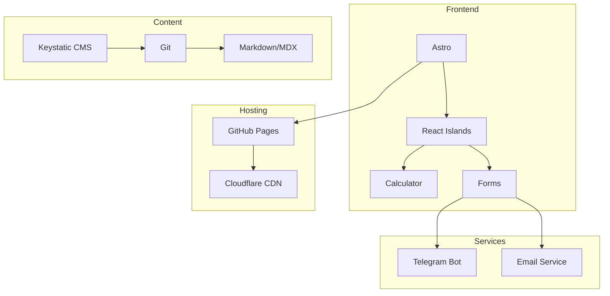

# Техническая архитектура: Веб-сайт UWS

**Версия:** 1.0  
**Дата:** 2026-02-06

---

## 1. Выбор технологий

### 1.1 Генератор статических сайтов: Astro 4.x

**Обоснование:**
- Island Architecture — минимальный JS-бандл
- Content Collections — типизированный контент
- Лучшая производительность для статического контента

### 1.2 Технологический стек

| Технология | Версия | Назначение |
|------------|--------|------------|
| Astro | 4.x | SSG фреймворк |
| React | 18.x | UI компоненты |
| TypeScript | 5.x | Типизация |
| Tailwind CSS | 3.x | Стилизация |
| Zustand | - | State management |
| React Hook Form | - | Формы |
| Zod | - | Валидация |

---

## 2. Архитектура системы



---

## 3. Файловая структура

```
uws-website/
├── config/
│   ├── tailwind.config.mjs
│   └── content/config.ts
├── public/
│   ├── favicon.svg
│   ├── robots.txt
│   └── images/
├── src/
│   ├── components/
│   │   ├── common/
│   │   ├── ui/
│   │   ├── forms/
│   │   ├── calculator/
│   │   └── seo/
│   ├── layouts/
│   ├── pages/
│   ├── content/
│   ├── styles/
│   └── utils/
├── astro.config.mjs
├── tsconfig.json
└── package.json
```

---

## 4. Контент-коллекции

### 4.1 Services

```typescript
// src/content/services/window-installation.md
---
title: Установка окон
description: Профессиональная установка окон в Киеве
icon: window-icon
order: 1
features:
  - Гарантия 5 лет
  - Немецкие профили
  - Быстрый монтаж
priceFrom: 2800
---
```

### 4.2 Blog

```typescript
// src/content/blog/article.md
---
title: Как выбрать окна
description: Полное руководство по выбору окон
publishDate: 2026-02-06
author: UWS
category: windows
tags: [окна, выбор, Киев]
featured: true
---
```

---

## 5. Интеграции

### 5.1 Telegram Bot

```typescript
// Cloudflare Worker для Telegram
export default {
  async fetch(request: Request): Promise<Response> {
    const data = await request.formData();
    await sendToTelegram(data);
    return new Response('OK');
  }
};
```

### 5.2 Email (Resend/SendGrid)

```typescript
await sendEmail({
  to: 'client@example.com',
  subject: 'Коммерческое предложение UWS',
  html: generateOfferPDF(data)
});
```

---

## 6. База данных (Supabase)

```sql
-- Заявки с калькулятора
CREATE TABLE calculator_orders (
  id UUID PRIMARY KEY DEFAULT gen_random_uuid(),
  created_at TIMESTAMP WITH TIME ZONE DEFAULT NOW(),
  customer_name TEXT NOT NULL,
  customer_phone TEXT NOT NULL,
  configuration JSONB NOT NULL,
  total_price DECIMAL(10,2),
  status TEXT DEFAULT 'new'
);
```

---

## 7. Хостинг и инфраструктура

| Сервис | Назначение |
|--------|------------|
| GitHub Pages | Хостинг статики |
| Cloudflare | DNS, CDN |
| Cloudflare Workers | Serverless functions |
| Keystatic | CMS |

---

**Документ:** Техническая архитектура  
**Часть:** 02-technical_architecture.md
