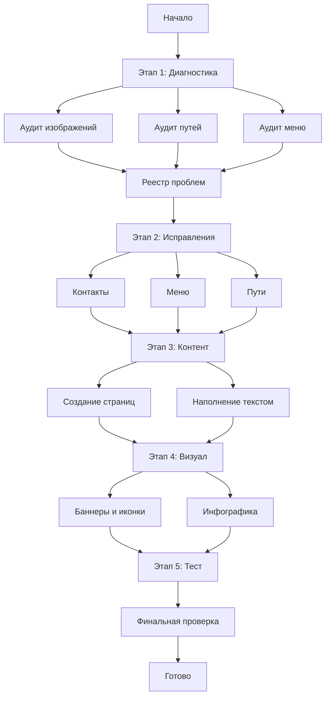

# План обновления веб-сайта UWS

**Дата создания:** 2026-02-07  
**Версия:** 1.0

---

## Резюме анализа

### Что было сделано
- Проведён аудит исходного сайта (C:\Users\tim21\OneDrive\Desktop\Site)
- Проведён анализ текущего проекта на Astro
- Сравнена контактная информация
- Изучена структура услуг
- Проверена реализация мобильного меню

---

## Раздел 1: Проблемы с отображением медиа-контента

### Выявленные проблемы

| Проблема | Файл | Текущий путь | Статус |
|----------|------|--------------|--------|
| Изображения услуг | [`ServicesGrid.astro`](src/components/blocks/ServicesGrid.astro:29) | `/images/services/*.jpg` | ✅ Файлы существуют в `public/images/services/` |
| Изображения блога | Various | `/images/blog/*.jpg` | ✅ Файлы существуют |
| Изображения проектов | Various | `/images/projects/*.jpg` | ✅ Файлы существуют |
| Изображения testimonials | Various | `/images/testimonials/*.jpg` | ✅ Файлы существуют |

### Рекомендации
1. Проверить каждый файл изображения на целостность
2. Добавить lazy loading для всех изображений
3. Оптимизировать форматы (WebP с фоллбэком)

---

## Раздел 2: Актуализация контактной информации

### Критические расхождения

| Поле | Текущее значение | Исходное значение | Приоритет |
|------|------------------|-------------------|-----------|
| Телефон 1 | +38 (044) 123-45-67 | +380660575202 | 🔴 Критично |
| Телефон 2 | Отсутствует | +380989478772 | 🔴 Критично |
| Телефон 3 | Отсутствует | +380633664769 | 🔴 Критично |
| Email | info@uws.com.ua | uws.kyiv@gmail.com | 🔴 Критично |
| График Пн-Пт | 9:00 - 18:00 | 09:00 - 19:00 | 🟡 Важно |
| График Сб-Нд | 10:00 - 14:00 | 10:00 - 17:00 | 🟡 Важно |
| Viber | Отсутствует | +380730705280 | 🟡 Важно |
| Telegram | Отсутствует | +380730705280 | 🟡 Важно |
| WhatsApp | Отсутствует | +380730705280 | 🟡 Важно |
| Facebook | Отсутствует | facebook.com/uws.kyiv | 🟢 Желательно |
| Instagram | Отсутствует | @uws_kyiv | 🟢 Желательно |

### Файлы для обновления
- [`src/pages/contacts.astro`](src/pages/contacts.astro:11) - основная страница контактов
- [`src/components/common/Footer.astro`](src/components/common/Footer.astro) - футер сайта
- [`src/components/seo/LocalBusiness.astro`](src/components/seo/LocalBusiness.astro) - SEO микроданные

---

## Раздел 3: Визуальное наполнение и информативность контента

### Текущее состояние

#### Главная страница
- Hero секция с тёмным фоном
- Сетка услуг с иконками
- CTA блок
- FAQ секция

#### Рекомендации по улучшению

1. **Добавить визуализации:**
   - Иконки для каждой услуги (уже есть SVG)
   - Изображения для карточек услуг
   - Фотографии команды
   - Процесс работы (шаги)

2. **Инфографика:**
   - Статистика компании (количество выполненных заказов, лет на рынке)
   - Схема работы
   - Преимущества в виде иконок с текстом

3. **Баннеры:**
   - Hero баннер с УТП
   - Баннер акций
   - Баннер "Заказать звонок"

---

## Раздел 4: Полнота переноса услуг

### Сравнительная таблица

| Услуга | Исходный сайт | Текущий сайт | Статус |
|--------|---------------|--------------|--------|
| Встановлення вікон та дверей | ✅ | ✅ ustanovka-okon | ✅ Перенесено |
| Ремонт вікон та дверей | ✅ | ✅ remont-vikon | ✅ Перенесено |
| Балкони і лоджії | ✅ | ✅ balkony | ✅ Перенесено |
| Москітні сітки | ✅ | ✅ moskitni-sitki | ✅ Перенесено |
| Заміна склопакетів | ✅ | ✅ stepklopaketi | ✅ Перенесено |
| Доводчики для дверей | ✅ | ✅ dovodchiki | ✅ Перенесено |

### Дополнительные страницы для создания

| Страница | Исходный файл | Статус |
|----------|---------------|--------|
| єВідновлення | vidnovlennya.html | ❌ Отсутствует |
| Акції | aktsiya.html | ❌ Отсутствует |
| Умови та гарантія | conditions.html | ❌ Отсутствует |
| Діагностика | diagnostics.html | ❌ Отсутствует |
| FAQ | faq.html | ✅ Частично (блок FAQ) |
| Догляд за ПВХ | doglyad.html | ❌ Отсутствует |
| Прайс | price.html | ✅ prices.astro |

---

## Раздел 5: Функциональность мобильного меню

### Анализ текущей реализации

Файл: [`src/components/common/Header.astro`](src/components/common/Header.astro:259)

#### Что реализовано:
- ✅ Открытие/закрытие меню по кнопке
- ✅ Закрытие по клику на backdrop
- ✅ Закрытие по клавише Escape
- ✅ Выпадающие списки для подпунктов
- ✅ Анимация переключения иконок

#### Возможные проблемы:
1. Не проверена работа на реальных устройствах
2. Возможны конфликты с View Transitions
3. Не проверена работа при быстром переключении

### Рекомендации
1. Добавить отладочное логирование
2. Проверить на различных разрешениях
3. Добавить анимацию плавного открытия/закрытия

---

## Раздел 6: Проблемы с директориями и путями

### Текущая система путей

BASE_PATH = '/UWS' (для GitHub Pages)

### Проверенные пути

| Путь | Файл | Статус |
|------|------|--------|
| /services/* | ServicesGrid.astro | ✅ Корректно |
| /contacts | contacts.astro | ✅ Корректно |
| /calculator | calculator.astro | ✅ Корректно |
| /blog/* | blog/[slug].astro | ✅ Корректно |
| /images/* | public/images/ | ✅ Корректно |

### Рекомендации
1. Создать утилиту для генерации путей
2. Добавить проверку путей при сборке
3. Использовать alias для импортов

---

## Этап 1: Диагностика и подготовка

### Задачи
- [ ] 1.1 Аудит изображений - проверить пути в коде и наличие файлов
- [ ] 1.2 Аудит путей к ресурсам - выявить неправильные пути
- [ ] 1.3 Аудит мобильного меню - проверить функциональность
- [ ] 1.4 Создать реестр проблем с приоритетами

---

## Этап 2: Исправление критических проблем

### Задачи
- [ ] 2.1 Обновить контактную информацию в contacts.astro
- [ ] 2.2 Обновить контактную информацию в Footer.astro
- [ ] 2.3 Обновить SEO микроданные
- [ ] 2.4 Исправить мобильное меню
- [ ] 2.5 Унифицировать систему путей
- [ ] 2.6 Добавить мессенджеры (Viber, Telegram, WhatsApp)

---

## Этап 3: Наполнение контентом

### Задачи
- [ ] 3.1 Создать страницу vidnovlennya.astro
- [ ] 3.2 Создать страницу aktsiya.astro
- [ ] 3.3 Создать страницу conditions.astro
- [ ] 3.4 Создать страницу diagnostics.astro
- [ ] 3.5 Создать страницу doglyad.astro
- [ ] 3.6 Расширить FAQ
- [ ] 3.7 Написать контент для каждой страницы

---

## Этап 4: Визуальное оформление

### Задачи
- [ ] 4.1 Разработать баннеры для ключевых разделов
- [ ] 4.2 Создать SVG иконки для всех услуг
- [ ] 4.3 Подготовить инфографику
- [ ] 4.4 Добавить визуальные элементы на страницы
- [ ] 4.5 Создать карточки услуг с изображениями

---

## Этап 5: Тестирование

### Задачи
- [ ] 5.1 Проверить все страницы на 404 ошибки
- [ ] 5.2 Тестирование мобильного меню на устройствах
- [ ] 5.3 Кроссбраузерное тестирование
- [ ] 5.4 Проверка адаптивности
- [ ] 5.5 Lighthouse аудит

---

## Диаграмма workflow

---

## Приоритеты выполнения

### 🔴 Критические (сделать в первую очередь)
1. Обновить контактную информацию (телефоны, email)
2. Исправить мобильное меню
3. Проверить все пути

### 🟡 Важные (вторая очередь)
1. Создать недостающие страницы
2. Добавить мессенджеры
3. Обновить график работы

### 🟢 Желательные (третья очередь)
1. Визуальные улучшения
2. Инфографика
3. Дополнительные баннеры

---

## Следующие шаги

1. Утвердить план
2. Переключиться в режим Code
3. Начать выполнение задач по порядку приоритета
